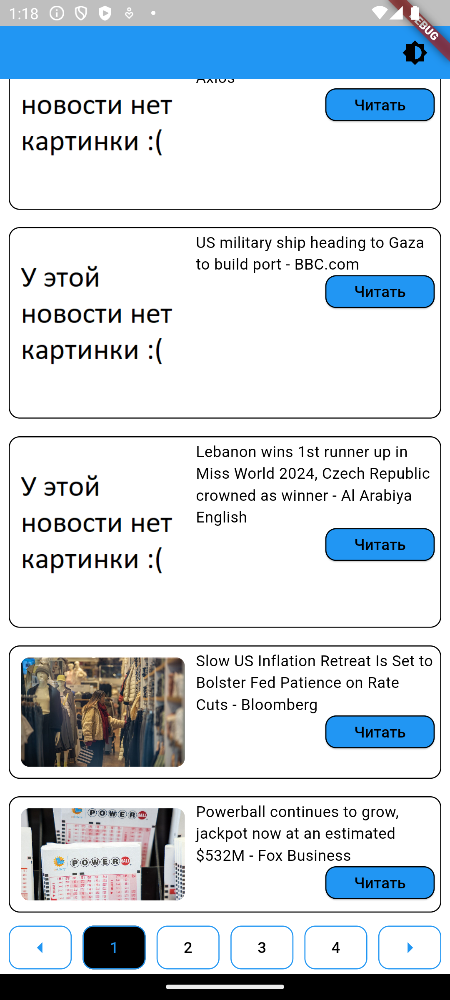

# Что это
Это приложение, которое берет данные с newsapi.org и выводит их в виде списка новостей. Скачать можно по ссылке: [app-release.apk](https://raw.githubusercontent.com/kosyan2917/flutter_dz1/master/app-release.apk)

## Как собрать
- Получить апи ключ на сайте newsapi.org
- Создать файл secrets.dart и положить его по пути lib/data
- Создать постоянную apiKey и в качестве значения присвоить полученный апи ключ
- Собрать приложение с помощью инструментов флаттера

## Функциональность

- Получение списка новостей
- Просмотр новости
- Возможность перейти к полной новости на сайте источника
- Поддержка светлой и темной темы

Это вторая версия, что нового:

- Кнопка "Мне нравится" или "Не нравится" у новости в зависимости от того,
была она лайкнута или нет
- Кнопка "Мне понравились", нажав на которую, можно получить список всех новостей,
которые были отмечены с помощью кнопки "Мне нравится"

Ниже представлены скриншоты приложения:
Главное меню светлая тема             |  Главное меню темная тема
:-------------------------:|:-------------------------:
  |  

Новость светлая тема             |  Новость темная тема
:-------------------------:|:-------------------------:
  |  

Лайкнутая новость          |  Список лайкнутых новостей
:-------------------------:|:-------------------------:
  |  

