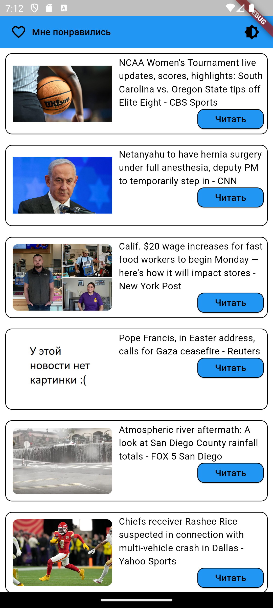
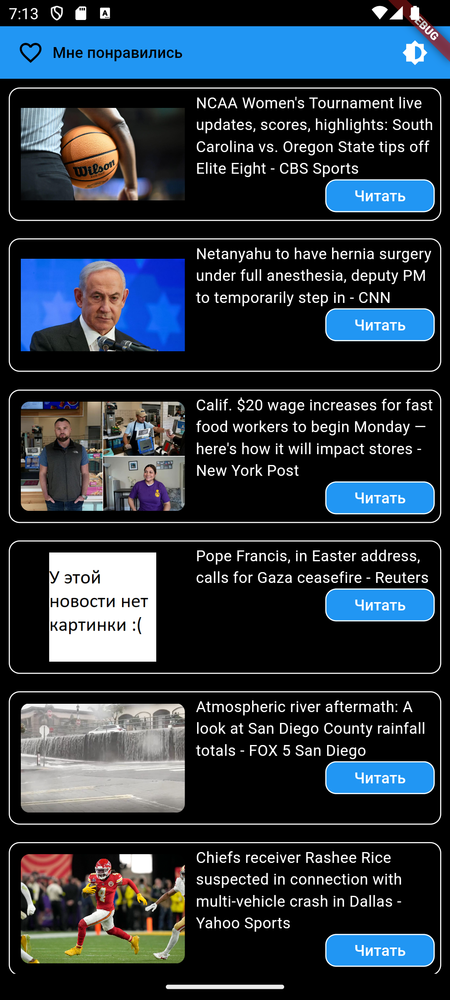

# Что это
Это приложение, которое берет данные с newsapi.org и выводит их в виде списка новостей. Скачать можно по ссылке: [app-release.apk](https://raw.githubusercontent.com/kosyan2917/flutter_dz1/master/app-release.apk)

## Функциональность

- Получение списка новостей
- Просмотр новости
- Возможность перейти к полной новости на сайте источника
- Поддержка светлой и темной темы

Ниже представлены скриншоты приложения:
Главное меню светлая тема             |  Главное меню темная тема
:-------------------------:|:-------------------------:
  |  

Новость светлая тема             |  Новость темная тема
:-------------------------:|:-------------------------:
  |  

